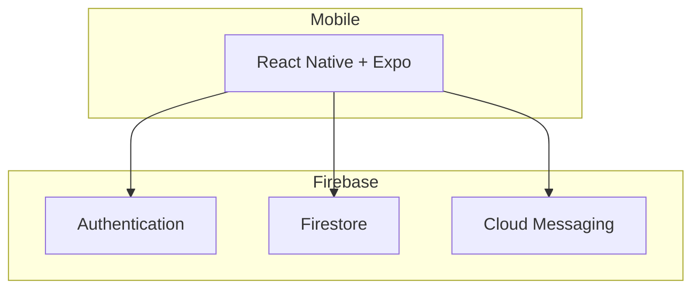

# Healthcare App

> Reference architecture for patient scheduling — React Native, Expo & Firebase.

---

## Overview

Reference architecture for a **healthcare patient scheduling** application, inspired by enterprise platforms serving **500k+ users** (QSaúde, Notredame Intermédica).

This repository documents the planned stack and domain model. Production healthcare code is maintained in private repositories.

---

## Planned Stack

| Layer | Technology |
|-------|------------|
| Mobile | React Native + Expo |
| Auth & Data | Firebase Authentication + Firestore |
| Language | TypeScript |
| Offline | Firebase offline persistence |
| Push | Firebase Cloud Messaging |

---

## Domain Context

Based on real-world healthcare experience:

| Project | Scale | Focus |
|---------|-------|-------|
| **QSaúde** | 500k+ users | Patient booking, iOS/Android |
| **Notredame** | Enterprise | Claims dashboards, GCP migration |

### Key capabilities (planned)

- Patient appointment booking
- Provider availability calendar
- Push notifications for reminders
- Offline-first mobile UX
- HIPAA-aware architecture patterns

---

## Architecture (reference)

---

## Related Projects

- [expo-firebase-reactnative](https://github.com/jonathasribeiro/expo-firebase-reactnative) — Firebase mobile patterns
- [FRONTEND](https://github.com/jonathasribeiro/FRONTEND) — Enterprise dashboard patterns

---

## Author

**Jonathas Ribeiro** — Senior Fullstack Engineer  
8+ years in healthcare (QSaúde, Notredame Intermédica)

---

> Production scheduling systems built for iOS, Android, and web — contact via LinkedIn for case studies.
